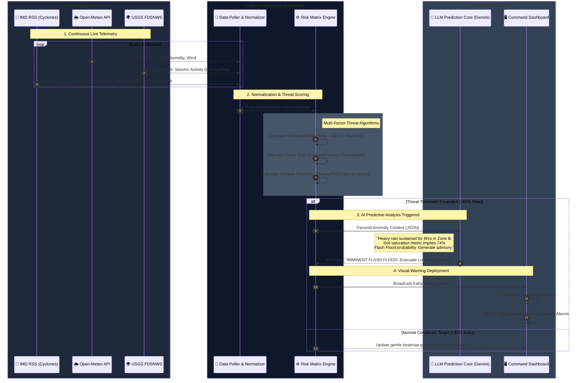

# AI-Based Disaster Early Warning Platform

A state-of-the-art, AI-powered command center designed for predicting, detecting, and managing natural and man-made disasters. The platform aggregates real-time environmental data (weather, seismic, atmospheric) and translates it into actionable intelligence through a massive multi-factorial risk engine. Key features include highly localized visualizations on top of authentic political boundaries, a context-aware AI Copilot for crisis response, and a robust architecture capable of processing thousands of data nodes concurrently.

---

## 🏗️ Architectural Flow and System Diagram

The platform utilizes a highly modular **Client-Edge-Database** architecture. The frontend is entirely decoupled from external services until initialization, where it concurrently aggregates data across multiple third-party environmental feeds and processes risk metrics on the client-side to minimize latency, falling back to edge infrastructure only for LLM (AI Copilot) integrations.

```mermaid
graph TD
    %% Beautiful Theming
    classDef frontend fill:#1e293b,stroke:#3b82f6,stroke-width:3px,color:#e2e8f0,shape:rect
    classDef edge fill:#0f172a,stroke:#8b5cf6,stroke-width:2px,color:#e2e8f0
    classDef logic fill:#334155,stroke:#10b981,stroke-width:2px,color:#e2e8f0
    classDef db fill:#475569,stroke:#f59e0b,stroke-width:2px,color:#fff
    classDef external fill:#1e1b4b,stroke:#ec4899,stroke-width:2px,stroke-dasharray: 4 4,color:#fce7f3

    subgraph User Interface [🖥️ Presentation Layer]
        UI([Web Dashboard<br/>React + Tailwind]):::frontend
        Map([Interactive GIS Maps<br/>Leaflet + Google Maps gl=IN]):::frontend
        Chat([AI Copilot Interface<br/>Context-Aware Chat]):::frontend
    end

    subgraph Middleware & Integration [🌐 Connectivity Layer]
        Auth([Supabase Auth<br/>JWT Sessions]):::edge
        Edge([Supabase Edge Functions<br/>Deno Runtime]):::edge
        RestFetch([Client-Side Parallel Fetcher<br/>REST Aggregation]):::edge
    end

    subgraph Business Logic [⚙️ Core Engines]
        Risk(Multi-Factor Risk Matrix<br/>Temperature, AQI, Geodata):::logic
        AI(AI Prediction Engine<br/>Gemini / LLM Integration):::logic
        Alerts(Early Warning System<br/>Pattern Recognition):::logic
    end

    subgraph Data Persistence [💾 Data Layer]
        SupabaseDB[(PostgreSQL<br/>Vector Extensions)]:::db
        Cache[(IndexedDB<br/>Offline Tile Cache)]:::db
    end

    subgraph External Sensors [🌍 Live Sensor Feeds]
        Meteo[[Open-Meteo<br/>Live Weather]]:::external
        AQI[[World Air Quality Index]]:::external
        USGS[[USGS FDSNWS<br/>Seismic Data]]:::external
        OSM[[Overpass API<br/>Emergency Facilities]]:::external
    end

    %% User interactions
    UI <--> Map
    UI <--> Chat
    UI --> Auth

    %% Map and Copilot networking
    Map -->|Batch API Requests| RestFetch
    Chat -->|Context & Chat History| Edge

    %% Core Data pipelines
    RestFetch -->|Calculates Risk| Risk
    Risk --> Alerts
    Edge -->|Prompt Engineering| AI

    %% DB Storage
    Auth --> SupabaseDB
    AI --> SupabaseDB
    Alerts --> SupabaseDB
    Map --> Cache

    %% Sensor integrations
    RestFetch -->|Bulk Coordinates| Meteo
    RestFetch -->|Batched REST| AQI
    RestFetch -->|Event Polling| USGS
    RestFetch -->|Node Queries| OSM

    style User Interface fill:transparent,stroke:#3b82f6,stroke-width:2px,stroke-dasharray: 5 5
    style Middleware & Integration fill:transparent,stroke:#8b5cf6,stroke-width:2px,stroke-dasharray: 5 5
    style Business Logic fill:transparent,stroke:#10b981,stroke-width:2px,stroke-dasharray: 5 5
    style Data Persistence fill:transparent,stroke:#f59e0b,stroke-width:2px,stroke-dasharray: 5 5
    style External Sensors fill:transparent,stroke:#ec4899,stroke-width:2px,stroke-dasharray: 5 5
```

---

## 🤖 Early Prediction & Early Warning Engine (Working Architecture)

The Early Prediction system is the intelligence core of the platform. It merges real-time quantitative telemetry (sensors) with qualitative analytical pattern recognition (AI) to generate actionable warnings *before* a disaster breaches safety thresholds. 



### Components of the Prediction Flow:
1. **The Poller (Data Intake):** A concurrent `setInterval` loop constantly fetches bulk telemetry. It natively parses completely different formats (e.g., converting the India Meteorological Department's archaic XML RSS feeds into structured JSON).
2. **The Risk Matrix (Algorithmic Logic):** Hard-coded statistical thresholds. It prevents the AI from being overrun with mundane data by acting as a mathematical gatekeeper. It specifically looks for *compound* risks (e.g., High Heat + Low Wind = Severe AQI Warning).
3. **The AI Core (Cognitive Generation):** Only engaged when the Risk Matrix fires a threshold breach. Complex anomalies are structured into strict prompt templates and fired to the external LLM to generate human-readable, highly specific evacuation and preparation logistics.

---

## ⚙️ System Workflow

1. **Initialization & Authentication**:
   - The user visits the application. The App verifies the user's JWT session via Supabase Authentication. 
   - Non-authenticated users are redirected to the login flow. Authenticated users connect to the central real-time dashboard.

2. **Data Aggregation (Concurrent Pipeline)**:
   - When the dashboard mounts, the **Client-Side Fetcher** initiates parallel, batched API requests to the `External Sensor` network. 
   - *Example:* Instead of polling 45 cities individually for weather, the system concatenates coordinates into a single bulk array to Open-Meteo to prevent `429 Too Many Requests` blockers. 
   - WAQI (Air Quality) and USGS (Earthquakes) feeds are subsequently queried and paginated. Overpass API dynamically scans a 25km radius around the user for critical node data (Hospitals, Police, Fire).

3. **Risk Matrix Calculation**:
   - The `Multi-Factor Risk Engine` intercepts the raw data arrays. It applies weighted algorithms to generate composite risk scores (e.g., combining high temperatures with spiking AQI levels to extrapolate health crisis vulnerabilities).
   - This risk data is normalized on a 0.0 to 1.0 scale and injected into the memory state of the GIS Map component.

4. **Visualization & UX**:
   - The `Interactive GIS Map` renders the data using Leaflet. The base maps are strictly configured to use **Google Maps (`gl=IN`)** to natively enforce official, undisputed Indian geopolitical boundaries without messy vector overlaps.
   - Advanced CSS Filters (`invert`, `hue-rotate`, `saturate`) are programmatically applied to the Google Maps raster tiles during Dark Mode to provide a beautiful, seamless, premium UI aesthetic.
   - Offline tile caching mechanism utilizes IndexedDB to guarantee rendering speeds and preserve functionality during localized network outages.

5. **AI Copilot & Alerting**:
   - Continuous scanning by the `Early Warning System` flags metrics exceeding normal operating limits, generating visual disaster blips (blinking pulse markers) on the map interface.
   - The user seamlessly interacts with the `AI Copilot Interface`. The user's specific context (current active alerts, local weather severity, visible map coordinates) is packaged into a JSON payload and shipped strictly to the `Supabase Edge Functions`.
   - The serverless Edge Function validates the JWT authorization, interacts securely with the central LLM (Google Gemini), parses the response stream, and returns intelligent, hyper-localized disaster prep advice.

---

## 💻 Technical Stack

### **Frontend (Presentation Tier)**
* **React 18**: Component-based UI architecture.
* **Vite**: Ultra-fast build tool and Hot Module Replacement engine.
* **TypeScript**: Strict type-checking validating complex API payloads and state objects.
* **Tailwind CSS**: Utility-first styling enabling responsive, gorgeous glass-morphic UI aesthetics and the custom `.dark-map-tiles` image inversion filters.
* **Leaflet.js**: Lightweight, high-performance web mapping library.
* **Lucide-React**: Dynamic SVG iconography.

### **Backend & BaaS (Integration Tier)**
* **Supabase**: Open-source Firebase alternative serving as the central nervous system.
* **PostgreSQL (Supabase BD)**: Relational database storing user histories, custom geo-locations, and application state metrics.
* **Deno / Supabase Edge Functions**: Distributed serverless runtime for secure execution of LLM prompts and API proxying (preventing CORS bottlenecks).

### **External APIs & Micro-Services (The Sensor Grid)**
* **Google Maps Tile API (`gl=IN`)**: Natively supplies authoritative Indian mapping boundaries suitable for Light and Dark modes.
* **Open-Meteo API**: Hyper-localized historical forecasting and live climate telemetry (batched parameters).
* **WAQI (World Air Quality Index)**: Live atmospheric hazard calculations.
* **USGS FDSNWS**: High-latency global earthquake telemetry feeds.
* **Overpass API**: Node/Way/Relation querying into the massive OpenStreetMap (OSM) database precisely engineered to rapidly source infrastructure data (Hospitals, Fire stations) within explicit radiuses.

---

## 🚀 Implementation Details 

### 1. Map Accuracy & Aesthetic Engineering
Balancing a beautiful UI ("Dark Mode") with absolute geopolitical accuracy was solved programmatically. Open-source maps (OSM, CartoDB) natively hardcode disputed international boundaries into their raster images. To fix this, the application entirely strips OSM fallback tiles. It initializes `Leaflet` strictly with `mt1.google.com...gl=IN` to establish the definitive legal border. 
To build the "Dark Mode" aesthetic without using a secondary map server, an aggressive custom CSS matrix is generated:
```css
/* Translates standard daytime Google Maps into a premium dark interface */
.dark-map-tiles {
  filter: invert(100%) hue-rotate(180deg) brightness(85%) contrast(120%) saturate(80%);
}
```

### 2. High-Performance Batch Data Ingestion
Disaster systems require huge volumes of data across massive regions (e.g., thousands of square kilometers of Indian territory). Rendering heatmaps conventionally results in massive bottlenecks and IP Rate-Limiting (`HTTP 429 Too Many Requests`). 
**Solution:** The application utilizes "Bulk Array Endpoints". Rather than fetching 45 distinct cities consecutively, the client compiles all required latitudes and longitudes into massive URL parameter strings, pushing a single payload to Open-Meteo. `Promise.allSettled()` handles dynamic WAQI API throttling natively with synthetic `setTimeout` delays between execution bursts—guaranteeing 100% data freshness without crashing or rate-limiting.

### 3. Serverless AI Copilot
The AI logic operates strictly adjacent to the user via **Supabase Edge Functions**. This design masks sensitive platform API keys on the server side to defend against inspection/extraction attacks. The Copilot is "System-Aware"; the frontend encapsulates the `active_disasters`, `user_location`, and `current_map_mode` into the payload so the LLM provides hyper-contextualized evacuation telemetry rather than generic advice.

### 4. Overpass API Search Algorithm
The `EmergencyServicesMap.tsx` leverages a finely-tuned Overpass QL query:
```javascript
// Lightweight `node` query logic targeting emergency amenities exclusively inside a hardcoded 25,000-meter radius buffer
`[out:json][timeout:25];(node["amenity"="hospital"](around:25000,${lat},${lng});...);out body;`
```
This algorithm replaces dense `nwr` (nodes, ways, relations) geometry fetching, cutting the OSM payload size by roughly 90%, preventing DNS lookup failures or `504 Gateway Timeouts`, and instantly highlighting survival infrastructure for the user.

### 5. Resilient Offline Tile Strategy
Using a custom Leaflet initialization sequence, the platform intercepts network requests for GIS mapped tiles. The images are processed into Blob formats and cached directly via browser Native Storage APIs (IndexedDB). If emergency infrastructure crashes wide-scale internet accessibility (e.g., major cyclone), the browser routes the map's grid generation through the IndexedDB cache seamlessly to preserve visual orientation. 
To prevent CORS blocking issues specific to rigorous commercial Tile Servers (like Google Maps), a graceful fallback executes `img.src = url` rendering natively through HTML bypassing Canvas strictness.
